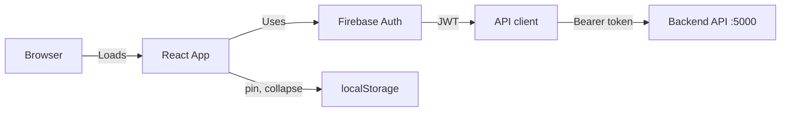
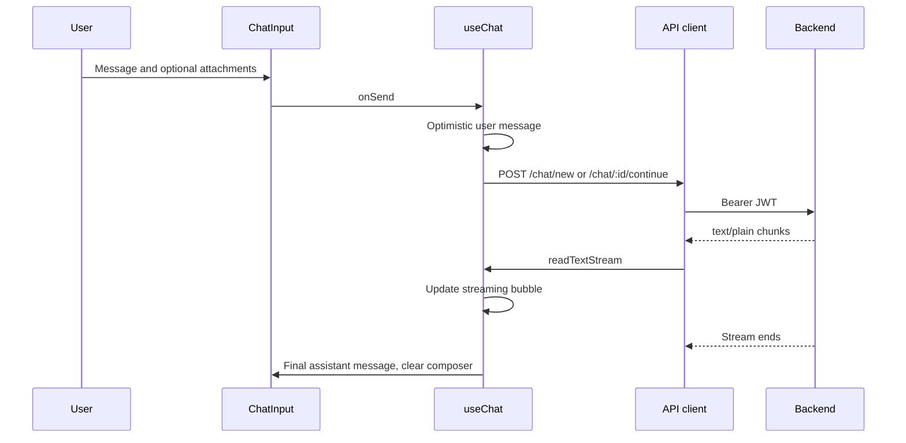

# Jerry AI — Frontend Architecture

Jerry AI is a browser chat UI: a React 19 single-page app on Vite 7. Users sign in with Firebase Auth. The app then calls the backend at `http://localhost:5000/api` for chats, profiles, and session sync.

Every backend request sends `Authorization: Bearer <Firebase ID token>`.

## Contents

1. [Stack](#stack)
2. [Architecture](#architecture)
3. [Codebase](#codebase)
4. [Routes](#routes)
5. [API endpoints](#api-endpoints)
6. [Authentication](#authentication)
7. [State](#state)
8. [Features](#features)
9. [Sidebar](#sidebar)
10. [Streaming](#streaming)
11. [Theme](#theme)
12. [Components](#components)
13. [Environment](#environment)
14. [Maintenance](#maintenance)

## Stack

| Layer | Library | Version | Role |
| --- | --- | --- | --- |
| Framework | react | ^19.2.0 | Functional components and hooks |
| DOM | react-dom | ^19.2.0 | Root render |
| Build | vite | ^7.3.1 | Bundling and HMR |
| Styling | tailwindcss | ^4.3.3 | Utility CSS, dark theme |
| Motion | framer-motion | ^12.34.0 | Layout and menu transitions |
| Routing | react-router-dom | ^7.13.0 | SPA navigation |
| Auth | firebase | ^12.18.0 | Email/password, Google, GitHub |
| Markdown | react-markdown | ^10.1.0 | Assistant message rendering |
| Markdown | remark-gfm | ^4.0.1 | GitHub-flavored markdown |
| Markdown | rehype-highlight | ^7.0.2 | Code highlighting |
| Icons | react-icons | ^5.5.0 | `Fi*`, `Lu*`, `Bs*` icons |
| Toasts | sonner | ^2.0.7 | Errors and status |
| Effects | canvas-confetti | ^1.9.4 | Celebration effects (not core) |
| Types | @types/react, @types/react-dom | ^19.2.x | Dev only |
| Lint | eslint + plugins | ^9.39.1 | Code quality |

There is no Redux or Zustand. State is React context, `useState`, and the `useChat` hook. UI-only flags (sidebar collapse, pinned chats) live in `localStorage`.

## Architecture



`src/main.jsx` mounts `FirebaseAuthProvider` → `AuthProvider` → the router.

## Codebase

```
src/
├─ api/
│  ├─ base.js                 API_BASE from VITE_API_BASE_URL
│  ├─ chat.js                 Chat CRUD, upload, streaming
│  └─ profile.js              Profile CRUD
├─ app/
│  └─ router.jsx              React Router v7 routes
├─ assets/
│  └─ jerry.svg
├─ const/
│  └─ ProfileMenu.jsx         Bottom-left user menu
├─ features/
│  ├─ auth/
│  │  ├─ AuthProvider.jsx
│  │  ├─ FirebaseAuthProvider.jsx
│  │  ├─ ProtectedRoute.jsx
│  │  ├─ PublicOnlyRoute.jsx
│  │  ├─ SocialAuthButtons.jsx
│  │  └─ useCombinedAuth.js
│  ├─ chat/
│  │  ├─ ChatPage.jsx
│  │  ├─ ChatWindow.jsx
│  │  ├─ ChatInput.jsx
│  │  ├─ MessageBubble.jsx
│  │  ├─ Sidebar.jsx
│  │  ├─ SearchChatsModal.jsx
│  │  ├─ useChat.js
│  │  └─ hooks/useDebounce.js
│  └─ profile/
│     ├─ EditProfileModal.jsx
│     └─ SettingsModal.jsx
├─ lib/
│  └─ firebase.js
├─ pages/
│  ├─ ProfilePage.jsx
│  ├─ SignInPage.jsx
│  └─ SignUpPage.jsx
├─ index.css                  Tailwind + dark theme tokens
└─ main.jsx
```

Vite config lives at the project root (`vite.config.js`), not under `src/`.

## Routes

Defined in `src/app/router.jsx`. Signed-in pages use `ProtectedRoute`. Sign-in and sign-up use `PublicOnlyRoute`.

| Path | Component | Notes |
| --- | --- | --- |
| `/` | ChatPage | Empty composer when there is no session |
| `/c/:sessionId` | ChatPage | Public UUID session |
| `/chat/:sessionId` | ChatPage | Legacy ObjectId deep link |
| `/profile` | ProfilePage | Opens `EditProfileModal` |
| `/sign-in/*` | SignInPage | Email/password and social login |
| `/sign-up/*` | SignUpPage | Account creation |
| `/login` | redirect | → `/sign-in` |
| `/register` | redirect | → `/sign-up` |

## API endpoints

Base URL: `VITE_API_BASE_URL`, default `http://localhost:5000/api` (`src/api/base.js`).

Helpers in `src/api/chat.js` and `src/api/profile.js` call `authHeaders(getToken)`, which awaits the Firebase ID token and sets `Authorization: Bearer <jwt>`. A non-OK response throws a short `Error`.

### Auth

| Method | Path | Caller | Purpose |
| --- | --- | --- | --- |
| POST | `/auth/sync` | `AuthProvider` | Create the Mongo user on first sign-in. Body `{}`. |

### Chat

| Method | Path | Function | Purpose |
| --- | --- | --- | --- |
| GET | `/chat/all` | `fetchAllChats` | Sidebar chat list |
| GET | `/chat/recent?limit=` | `fetchRecentChats` | Recent chats in search |
| GET | `/chat/search?q=&limit=` | `searchChats` | Server search |
| POST | `/chat/session` | session helper | Resolve a session |
| GET | `/chat/:chatId` | load chat | One chat |
| DELETE | `/chat/:chatId` | `deleteChat` | Delete a chat |
| PATCH | `/chat/:chatId/rename` | `renameChat` | Rename |
| POST | `/chat/new` | `postChatStream` | New chat, streamed body |
| POST | `/chat/:chatId/continue` | `postChatStream` | Continue a chat, streamed body |
| PUT | `/chat/:chatId/edit/:messageId` | `editMessage` | Edit a message |
| POST | `/chat/upload` | `uploadChatFile` | `FormData` file upload (GridFS) |

`readTextStream` in `src/api/chat.js` reads `response.body` as UTF-8 and calls `onChunk(full, chunk)` so the UI can update a `role: "streaming"` bubble.

### Profile

| Method | Path | Purpose |
| --- | --- | --- |
| GET | `/profile` | Load profile |
| PUT | `/profile` | Update profile |
| DELETE | `/profile` | Delete profile |
| POST | `/profile/avatar` | Avatar upload |
| GET | `/profile/username-available?username=` | Username check |
| POST | `/profile/revoke-sessions` | Revoke sessions |

## Authentication

1. `src/lib/firebase.js` initializes Firebase from `VITE_FIREBASE_*`.
2. `SignInPage` and `SignUpPage` call email/password or `signInWithGoogle` / `signInWithGithub`.
3. `FirebaseAuthProvider` listens with `onAuthStateChanged`. `useFirebaseAuth` exposes `user`, `loading`, `signIn`, `signOut`, `signUp`, social sign-in, and `getIdToken`.
4. `AuthProvider` normalizes `{ uid, email, displayName, photoURL, getIdToken }`.
5. On first sign-in it POSTs `/auth/sync` with the JWT.
6. API helpers attach that JWT on every request.

## State

| Scope | Technique | What it holds |
| --- | --- | --- |
| Auth | `AuthProvider` + `useAuth` | `user`, `loading`, `getIdToken`, `signOut` |
| Chat | `useChat(user)` | messages, loading, active chat id/title, send, edit, load, create, rename, delete |
| Sidebar | `useState` + `localStorage` | `jerry.sidebar.collapsed` (`"1"` / `"0"`), `jerry.sidebar.pinnedChatIds` (JSON array) |
| Modals | `isOpen` + `createPortal` | Profile and settings |
| Input | `useDebounce` | Username availability and chat search |
| Stream | `setMessages` | Temporary `role: "streaming"` bubble, then the final assistant message |
| Theme | CSS variables on `:root` | Dark only. No runtime toggle. |

## Features

| Module | Files | Responsibility |
| --- | --- | --- |
| Auth | `src/lib/firebase.js`, `src/features/auth/*` | Sign-in, user shape, backend sync |
| Chat | `src/features/chat/*`, `src/api/chat.js` | List, composer, stream, CRUD, search, URL session |
| Profile | `src/features/profile/*`, `src/api/profile.js` | Name, username, avatar, settings |
| Routing | `src/app/router.jsx` | Protected and public routes |
| Theme | `src/index.css` | Dark tokens and keyframes |
| Utilities | `useDebounce.js`, `ProfileMenu.jsx` | Debounce and the user menu |

## Sidebar

`src/features/chat/Sidebar.jsx`

- Chat list from `fetchAllChats`.
- Pins in `localStorage` key `jerry.sidebar.pinnedChatIds`.
- Collapse in `jerry.sidebar.collapsed`.
- Right-click menu (portal): open in new tab, rename, pin/unpin, delete.
- Search opens `SearchChatsModal` (debounced `fetchRecentChats` or `searchChats`).
- Motion: Framer Motion slide and menu fade.
- Width: 260px expanded, 52px collapsed. Below `md`, it is a temporary drawer.

## Streaming



1. `postChatStream(getToken, { chatId, prompt, attachments })` POSTs JSON.
2. The body is streamed `text/plain`.
3. `readTextStream` concatenates chunks and calls `onChunk`.
4. `sendMessage` and `editMessage` keep a `role: "streaming"` entry (three-dot typing indicator in `MessageBubble`).
5. On end, that entry becomes the final assistant message. `requestId` can sync the URL.

## Theme

Dark only. Tokens live on `:root` in `src/index.css`. Components use `var(--surface)`, `var(--text-primary)`, and the rest.

```css
:root {
  --surface: #000000;
  --surface-elevated: #000000;
  --border-subtle: rgba(255, 255, 255, 0.06);
  --text-primary: #e5e7eb;
  --accent: #7c5cfc;
}
```

Settings shows “Appearance → Dark” as a static label.

## Components

| Component | File | Responsibility |
| --- | --- | --- |
| Router bootstrap | `src/main.jsx` | Providers and router |
| AuthProvider | `src/features/auth/AuthProvider.jsx` | User object and `/auth/sync` |
| FirebaseAuthProvider | `src/features/auth/FirebaseAuthProvider.jsx` | Firebase listener and sign-in/out |
| ProtectedRoute / PublicOnlyRoute | `src/features/auth/ProtectedRoute.jsx` | Route guards |
| SocialAuthButtons | `src/features/auth/SocialAuthButtons.jsx` | Google and GitHub |
| SignInPage / SignUpPage | `src/pages/*.jsx` | Public auth forms |
| ChatPage | `src/features/chat/ChatPage.jsx` | Sidebar + chat window |
| ChatWindow | `src/features/chat/ChatWindow.jsx` | Transcript, top bar, composer dock |
| ChatInput | `src/features/chat/ChatInput.jsx` | Composer, attachments, send |
| MessageBubble | `src/features/chat/MessageBubble.jsx` | Markdown, attachments, edit, streaming |
| useChat | `src/features/chat/useChat.js` | Chat state and URL sync |
| Sidebar | `src/features/chat/Sidebar.jsx` | List, pin, collapse, menu, search |
| SearchChatsModal | `src/features/chat/SearchChatsModal.jsx` | Recent chats and search |
| ProfileMenu | `src/const/ProfileMenu.jsx` | Avatar menu, profile, settings, logout |
| EditProfileModal | `src/features/profile/EditProfileModal.jsx` | Name, username, avatar |
| SettingsModal | `src/features/profile/SettingsModal.jsx` | Appearance (fixed Dark), language |
| API modules | `src/api/*.js` | `fetch` wrappers and JWT |
| readTextStream | `src/api/chat.js` | Stream reader |

## Environment

Read with `import.meta.env.VITE_*`. Vite injects them at build time. Copy `.env.example` to `.env.development`.

| Variable | Purpose |
| --- | --- |
| `VITE_API_BASE_URL` | API root. Fallback `http://localhost:5000/api` |
| `VITE_FIREBASE_API_KEY` | Firebase web API key |
| `VITE_FIREBASE_AUTH_DOMAIN` | Auth domain |
| `VITE_FIREBASE_PROJECT_ID` | Project id |
| `VITE_FIREBASE_STORAGE_BUCKET` | Storage bucket (avatar uploads) |
| `VITE_FIREBASE_MESSAGING_SENDER_ID` | FCM sender id (unused in the UI) |
| `VITE_FIREBASE_APP_ID` | Firebase app id |

## Maintenance

- Package version: `0.0.0` (`package.json`).
- Last audited: 2026-09-15.
- Possible later work: a light-mode toggle, replacing the custom text stream with WebSocket or SSE, and moving sidebar collapse/pin state into a small context for tests.

This document describes the frontend as implemented. It does not add features that are not in the codebase.
