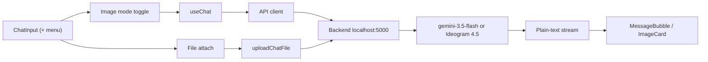

# Jerry — Frontend Architecture

Jerry is a React 19 chat client (Vite 7, Tailwind CSS 4) that talks to `jerry-api` on `localhost:5000`. Auth is Firebase. The UI is a dark-only Grok-style surface system. Image generation is an explicit composer tool: the client sends `mode: "image" | "text"` and never guesses intent.

This repo is the frontend. The API lives in the [jerry backend](https://github.com/tejasM17/jerry).

## Key characteristics

| Area | Choice |
| --- | --- |
| Framework | React 19 + Vite 7 (ESM) |
| Styling | Tailwind 4 + CSS custom properties (Grok-style dark-only design tokens) |
| Auth | Firebase Auth (`firebase`): Google, GitHub, email + password |
| Routing | React Router 7; URL-driven chat sessions |
| API | `Authorization: Bearer` Firebase ID token; chat CRUD + plain-text stream |
| AI models | Gemini 3.5 Flash (text), Ideogram 4.5 image generation via backend. Chosen on the backend from `mode`; the client does not send model ids |
| Image generation | No new dependencies. Uses the existing React, Framer Motion, and chat API stack. Explicit + menu sends `mode: "image"` or `"text"`; the client does not detect intent |
| Markdown | react-markdown + rehype-highlight + remark-gfm |
| Motion / icons | Framer Motion; lucide-react, react-icons |
| Toasts | sonner |

## High-level architecture



The backend generates images only when `mode === "image"`, using Ideogram 4.5 image generation via backend. Text turns use `gemini-3.5-flash`. The frontend never guesses intent and never names a model.

Other surfaces: `FirebaseAuthProvider` → `AuthProvider` (syncs the Mongo user) → router. Protected chat and profile routes. File uploads go through `uploadChatFile` to GridFS at `/api/chat/upload`.

## Folder structure

```
src/
  main.jsx                         FirebaseAuthProvider → AuthProvider → Router
  index.css                        Grok-style design tokens (dark only)
  app/router.jsx                   /, /sign-in, /sign-up, /profile
  api/base.js                      API_BASE
  api/chat.js                      chat CRUD, postChatStream (includes mode)
  api/profile.js                   profile API
  lib/firebase.js                  Firebase app
  features/auth/                   AuthProvider, route guards, social buttons
  features/chat/
    ChatPage.jsx                   chat shell
    ChatWindow.jsx                 message list, image pending + error retry
    ChatInput.jsx                  Composer with Grok-style + menu (Create image / Attach file), image mode toggle
    ImageCard.jsx                  Grok-style generated-image card: rounded, hover actions (Download / Open full-size / Copy URL), full-screen lightbox viewer, falls back to markdown-image parsing for legacy chats
    MessageBubble.jsx              markdown + ImageCard upgrade from attachments
    Sidebar.jsx                    session list
    useChat.js                     session state, optimistic send, stream
  features/profile/                settings and edit-profile modals
  pages/                           SignIn, SignUp, Profile
```

## State management

| State | Where it lives |
| --- | --- |
| Firebase session | `FirebaseAuthProvider` / `AuthProvider` |
| Active chat, messages, stream | `useChat.js` |
| Selected session | URL (`react-router`) |
| Image tool | useState in useChat | imageMode boolean, one-shot (resets after send) |

## Feature modules

| Module | Responsibility |
| --- | --- |
| Auth | Firebase sign-in, `ProtectedRoute` / `PublicOnlyRoute`, POST `/api/auth/sync`. After sign-in or sign-up the app lands on `/`. |
| Chat | List, composer with + menu, image mode, stream, CRUD, search, URL session |
| Profile | Display name and account settings against `api/profile.js` |

## Components

| Component | Responsibility |
| --- | --- |
| ChatInput | Composer, + menu (Create image / Attach file), image mode, send |
| ChatWindow | Transcript, image pending shimmer, error card with retry |
| ImageCard | Generated image: rounded card, download, full-size, copy URL, lightbox |
| MessageBubble | Markdown plus ImageCard upgrade from attachments |
| useChat | Session state, optimistic send, stream, `imageMode` |

## Design system

Tokens live in `src/index.css` (`:root` and the Tailwind `@theme` aliases). The app is dark-only. Elevation comes from lighter surfaces, not drop shadows.

| Token | Value | Role |
| --- | --- | --- |
| `--bg` | `#0d0d0f` | Page |
| `--surface-1` | `#141416` | Sidebar, composer |
| `--surface-2` | `#1b1b1f` | Raised panels |
| `--surface-3` | `#232329` | Overlays, menus |
| `--text-primary` | `#e8e8ea` | Body |
| `--text-secondary` | `#a0a0a8` | Secondary |
| `--text-tertiary` | `#6b6b74` | Hints, placeholders |
| `--accent` | `#3f8cff` | Focus, links, the image-tool chip. Use it sparingly |
| `--radius-sm` / `md` / `lg` / `pill` | `8px` / `12px` / `20px` / `9999px` | Controls, cards, pills |
| `--dur-fast` / `--dur-med` | `150ms` / `250ms` | Hover and panel motion, `--ease-out` (`cubic-bezier(0.22, 1, 0.36, 1)`) |
| `--error` | `#ff5f56` | Failures; `--error-surface` is `rgba(255, 95, 86, 0.08)` |

Rules:

- No pure black (`#000`) or pure white (`#fff`) for surfaces or text.
- No heavy shadows in dark mode. A single overlay shadow (`--shadow-overlay`) is reserved for menus and the lightbox.
- No fake UI: do not draw chrome that is not a real control.

## API client layer

`src/api/chat.js` attaches `Authorization: Bearer ${idToken}`.

| Function | Request |
| --- | --- |
| `postChatStream` | Body: { prompt, attachments?, sessionId?, mode?: 'image'\|'text' } |

`attachments` and `sessionId` are optional. `mode` is `"image"` or `"text"`.

The response is still a plain-text stream. When the backend generates an image it streams markdown:

```markdown

```

On failure it streams the exact string `[Error generating image. Please try again.]`, which the chat window renders as a styled error card with Retry. After reload, persisted `attachments[]` (`{ fileId, url, mimeType, name }`) on the assistant message upgrade that markdown image to `ImageCard`.

## Image Generation

- Explicit tool selection via the composer + menu (Create image). The client does not auto-detect image intent.
- The backend generates an image only when the request body has `mode: "image"` (Ideogram 4.5 image generation via backend). Text sends use `mode: "text"` (`gemini-3.5-flash`).
- While an image turn is in flight, the transcript shows a shimmer loading state. A failed generation renders an error card with retry.
- Generated images are stored in GridFS and rendered with `ImageCard`.

## Getting started

1. Copy `.env.example` to `.env.development`.
2. Set `VITE_API_BASE_URL=http://localhost:5000/api` and the `VITE_FIREBASE_*` keys. Production (Vercel) is in `PRODUCTION.md`.
3. In Firebase Console, enable Email/Password, Google, and GitHub, and authorize `localhost` plus the Vercel host.
4. Run `npm install` and `npm run dev`. The API must be on port 5000 and must verify Firebase ID tokens.

App: `http://localhost:5173`. Sign-in: `/sign-in`. Sign-up: `/sign-up`. Profile: `/profile`.

Keyboard: **Enter** sends, **Shift + Enter** inserts a newline.

*Jerry can make mistakes. Verify important information.*
